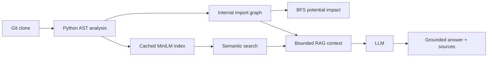

# CodeAtlas

CodeAtlas maps a public Python GitHub repository: AST-derived symbols, an internal import graph, potential-impact analysis, MiniLM semantic search, and optional grounded Q&A with file and line citations.

It is a local developer tool (FastAPI + React), not a hosted coding agent.

## Architecture



## Features

- Clone a public GitHub HTTPS repository and analyze Python files with size/file-count limits
- Extract functions, classes, methods, imports, and source spans
- Resolve internal imports into a file-level dependency graph
- Server-side BFS potential-impact (direct and transitive dependents)
- Cached `all-MiniLM-L6-v2` semantic retrieval over symbols
- Structure-aware RAG: retrieve → compact structural context → LLM → citations
- React UI: overview, graph, impact panel, search, Ask CodeAtlas

## Technical architecture

| Layer | Role |
| --- | --- |
| `analyzer.py` | Walk the clone, parse AST, classify imports |
| `impact.py` | Reverse-graph BFS from a selected file |
| `semantic.py` | Embed symbols once per analysis; cosine search |
| `reranker.py` | Optional PyTorch experiment (off by default) |
| `rag.py` / `llm.py` | Bounded context + OpenAI-compatible chat |
| `store.py` | In-memory analysis records (process lifetime) |
| FastAPI | REST: analyze, search, impact, ask |
| React | Visualization and query UI |

Analyses live in memory. Restarting the API drops them. Repository code is never executed.

## AST and import resolution

Python files are parsed with the standard `ast` module. Symbols keep qualified names, types, arguments, docstrings, and line ranges.

Imports are classified as internal, stdlib, third-party, or unresolved. Only **internal** imports become graph edges (`source` file depends on `target` file). Resolution is path-based (package layout, including common `src/` layouts), not a full import emulator.

## Potential-impact BFS

The graph is reversed so an edge means “this file depends on the selected file.” Breadth-first search lists downstream dependents: distance 1 is direct, greater distances are transitive. Isolated files have zero impact.

This is static import impact, not runtime call-graph or test-coverage impact.

## Semantic retrieval

Searchable symbols (functions, async functions, classes, methods) are embedded with Sentence-Transformers `all-MiniLM-L6-v2`. Vectors are cached on the analysis record. A query is encoded once and ranked by cosine similarity.

## PyTorch reranker experiment

A small feed-forward reranker was trained on query-level splits of `training_data.json` (18 / 6 / 6 queries) and evaluated on a **candidate set of 4 symbols per query**, not full-corpus retrieval.

Held-out test (6 queries):

| Setting | Hit@1 | MRR |
| --- | --- | --- |
| MiniLM | 0.833 | 0.917 |
| MiniLM + reranker | 0.833 | 0.917 |

The reranker did **not** improve held-out ranking, so `RERANKER_ENABLED` is `False` in `config.py`. Training artifacts remain under `outputs/reranker/` and `scripts/train_reranker.py`.

## Structure-aware RAG

`POST /analyses/{id}/ask` reuses semantic search (top 5 symbols), then builds a compact prompt: file, qualified name, type, line range, clipped source, and a few direct import edges. It does not dump whole files or the full graph.

The LLM is instructed to answer only from that context, refuse when evidence is missing, and cite `[path/file.py:L10-L25]`. Source metadata in the JSON response comes from retrieval, not from parsing the model’s prose.

## Setup and run

Requires Python 3.11+, Node.js 20+, and git.

```bash
python3 -m venv .venv
source .venv/bin/activate   # Windows: .venv\Scripts\activate
pip install -r requirements.txt

cp .env.example .env        # then set CODEATLAS_LLM_API_KEY if you use Ask
uvicorn main:app --reload --port 8000
```

API docs: http://localhost:8000/docs

```bash
cd frontend
cp .env.example .env        # default VITE_API_BASE_URL=http://localhost:8000
npm install
npm run dev
```

UI: http://localhost:5173

First MiniLM download can take a while. Analyze a **small public** Python repo first.

Production frontend:

```bash
cd frontend
npm run build
npm run preview             # http://localhost:4173
```

CORS defaults allow Vite dev (5173) and preview (4173). Override with `CORS_ORIGINS` (comma-separated). The backend does not serve the built SPA; run API and UI as two processes, or put a reverse proxy in front.

## LLM environment variables

| Variable | Required | Default |
| --- | --- | --- |
| `CODEATLAS_LLM_API_KEY` | Yes, for Ask CodeAtlas | unset → HTTP 503 |
| `CODEATLAS_LLM_BASE_URL` | No | `https://api.openai.com/v1` |
| `CODEATLAS_LLM_MODEL` | No | `gpt-4o-mini` |
| `CORS_ORIGINS` | No | localhost Vite origins |
| `VITE_API_BASE_URL` | Frontend | `http://localhost:8000` |

Do not commit `.env` files. `.env.example` contains names only.

Export backend variables in the shell that runs uvicorn (this project does not auto-load `.env` into Python).

## Testing

```bash
source .venv/bin/activate
python -m pytest tests
```

```bash
cd frontend
npm run build
```

RAG tests mock the LLM. They do not call a provider.

## Limitations

- Public GitHub HTTPS URLs only; clone and parse limits apply (`config.py`)
- In-memory store; not multi-user or durable
- Import graph is file-level, not a call graph
- Semantic search quality depends on MiniLM and symbol text; the reranker is off
- RAG sees only the top retrieved symbols and a few edges
- LLM answers can still be incomplete even with citations
- No authentication, rate limiting, or hosted deployment included

## Project structure

```
analyzer.py          AST walk, import classification
impact.py            Reverse-graph BFS
semantic.py          MiniLM index + search
reranker.py          Optional ranking experiment
rag.py / llm.py      Context builder + chat client
config.py            Limits, retrieval, LLM env names
services.py          Application use cases
routes.py / schemas.py / store.py / main.py
scripts/train_reranker.py
training_data.json
outputs/             Retrieval notes and reranker metrics/checkpoint
frontend/            React + Vite UI
tests/               pytest suite
sample_repo/         Tiny local fixture
```
